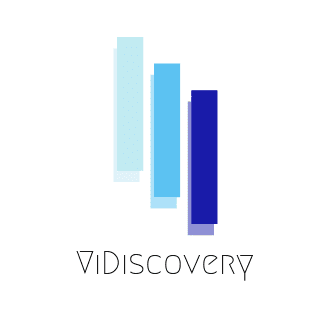

# ViDiscovery Recognition Module

## Prerequisites



Follow instructions https://docs.anaconda.com/anaconda/install/ to install anaconda

* Create the environment from the environment.yml file:

```shell script
$ conda env create -f env-setup/environment_setup.yml
```
    
* Activate env by using next command (if not activated by default):

```shell script
$ conda activate vidiscovery-recognition
```
    
* To update the contents of your environment.yml file accordingly and then run the following command:

```shell script
$ conda env update --prefix ./env --file env-setup/environment_setup.yml  --prune
```

* Install and start MongoDB server. There is no need to create DB or collections. Everything will be setuped automatically.

## How to use

1. Run Flask server by using predefined script from the root directory of project:

```shell script
$ sh run_server.sh
```

You should see the following logs:

```text
2021/05/14T22:07:08 werkzeug [INFO]  * Restarting with stat
2021/05/14T22:07:16 werkzeug [WARNING]  * Debugger is active!
2021/05/14T22:07:16 werkzeug [INFO]  * Debugger PIN: 266-959-897
(6884) wsgi starting up on http://127.0.0.1:5000
```

This means that server successfully started on your local system.

Then in order to use the main functionality of system go to `localhost:5000/search` link.
You should see the main page of WebApplication with only one main form.
To start video fragment identification process - perform next simple steps:
*  Click on **Select File** button
* File selection dialog will popup with request to select target fragment from local file system. The video fragment should be a small video up to 25 seconds (.mp4 or .mov extensions)
* As soon as fragment was  selected - click **Search** button
* Wait few seconds and enjoy the bounce loader untill result will be shown
* In case of the successful identification - modal window with original identified video information will be shown (video name, search time).
There is and ability to play target video from the point of matching.
  
* There is and feature to review history of previous searches. Just click on **Show history** label. After the click left panel will slide out.
That panel contains list of previous search results with main information about video and time of attempt.
  
  